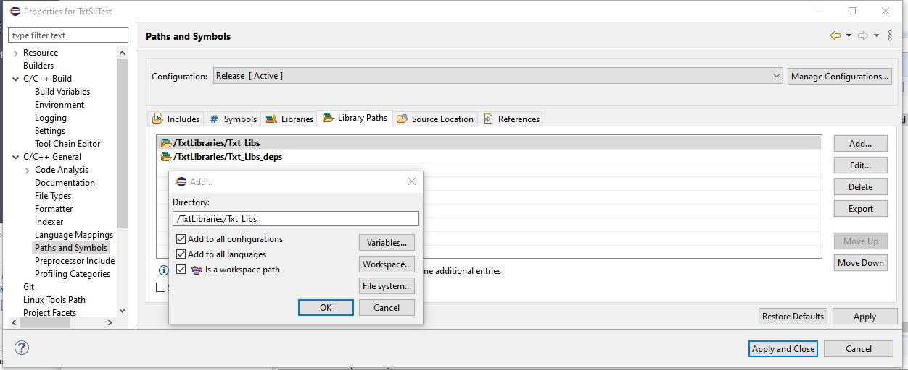
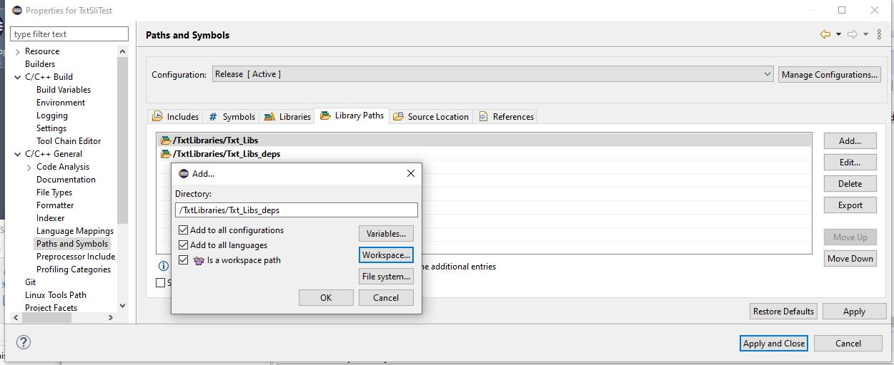
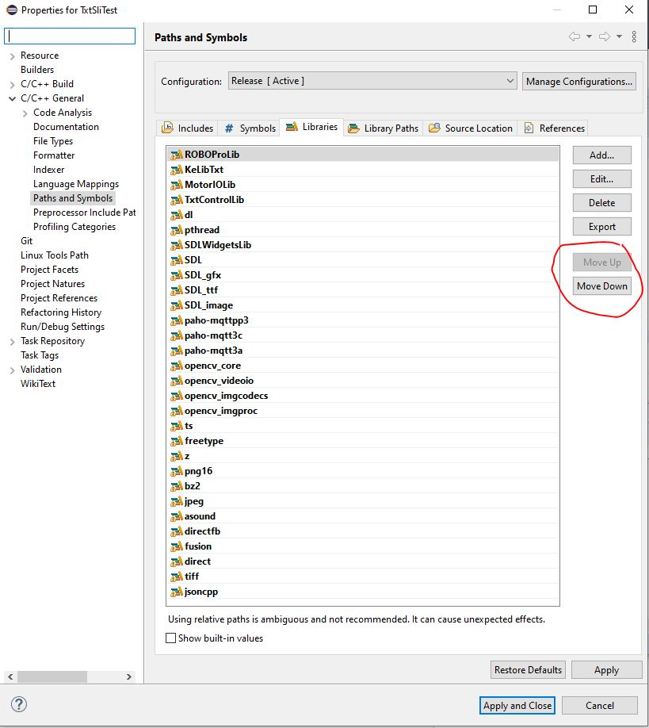

<!-- TOC depthFrom:1 depthTo:6 withLinks:1 updateOnSave:1 orderedList:0 -->

- [TXT C/C++ programming supporting libraries](#txt-cc-programming-supporting-libraries)
	- [How to add this libraries and includes to  TXT SLI or application Eclipse project?](#how-to-add-this-libraries-and-includes-to-txt-sli-or-application-eclipse-project)
		- [How to add the include path?](#how-to-add-the-include-path)
		- [How to add both library paths?](#how-to-add-both-library-paths)
		- [How to change the library list?](#how-to-change-the-library-list)
			- [Normal way](#normal-way)
			- [Alternative to update the library list](#alternative-to-update-the-library-list)
				- [The XML-code to add](#the-xml-code-to-add)
- [document history <a id="history"></a>](#document-history-a-idhistorya)

<!-- /TOC -->
# TXT C/C++ programming supporting libraries
version: 2020-04-26

TXT firmware 4.6.6 , 4.7.0

Based on the deps map in [fischertechnik txt_training_factory](https://github.com/fischertechnik/txt_training_factory).

The libraries and includes are put in this Eclipse project.
This makes relative path possible


## How to add this libraries and includes to  TXT SLI or application Eclipse project?

### How to add the include path?
Add to the include path


###  How to add both library paths?
Add both maps to the library path





### How to change the library list?
#### Normal way
The library list in the Eclipse .cproject files need to be updated too.<br/>
Add the names of the shared libraries to the library list, manually one by one.

You can remove libs you don't need in your project or add a name.<br/>
Sometimes it could be necessary to change to order, select a lib name and move it up/down.

#### Alternative to update the library list
For the more experience software developers.<br/>
You can also copy this list into the .cproject file (XML-file)
1. How to find were to insert this code?
1. Make a dummy name in the project file, for example DummyXXX. 
1. Close the project. 
1. Open the .cproject in Notepad++.
1. Search the DummyXXX and add the code lines.
1. Don't forget to remove the dummy.


##### The XML-code to add
For this set of libraries you will need this list<br/>
```
									<listOptionValue builtIn="false" srcPrefixMapping="" srcRootPath="" value="ROBOProLib"/>
									<listOptionValue builtIn="false" srcPrefixMapping="" srcRootPath="" value="KeLibTxt"/>
									<listOptionValue builtIn="false" srcPrefixMapping="" srcRootPath="" value="MotorIOLib"/>
									<listOptionValue builtIn="false" srcPrefixMapping="" srcRootPath="" value="TxtControlLib"/>
									<listOptionValue builtIn="false" value="dl"/>
									<listOptionValue builtIn="false" value="pthread"/>
									<listOptionValue builtIn="false" value="SDLWidgetsLib"/>
									<listOptionValue builtIn="false" value="SDL"/>
									<listOptionValue builtIn="false" value="SDL_gfx"/>
									<listOptionValue builtIn="false" value="SDL_ttf"/>
									<listOptionValue builtIn="false" value="SDL_image"/>
									<listOptionValue builtIn="false" value="paho-mqttpp3"/>
									<listOptionValue builtIn="false" value="paho-mqtt3c"/>
									<listOptionValue builtIn="false" value="paho-mqtt3a"/>
									<listOptionValue builtIn="false" value="opencv_core"/>
									<listOptionValue builtIn="false" value="opencv_videoio"/>
									<listOptionValue builtIn="false" value="opencv_imgcodecs"/>
									<listOptionValue builtIn="false" value="opencv_imgproc"/>
									<listOptionValue builtIn="false" value="ts"/>
									<listOptionValue builtIn="false" value="freetype"/>
									<listOptionValue builtIn="false" value="z"/>
									<listOptionValue builtIn="false" value="png16"/>
									<listOptionValue builtIn="false" value="bz2"/>
									<listOptionValue builtIn="false" value="jpeg"/>
									<listOptionValue builtIn="false" value="asound"/>
									<listOptionValue builtIn="false" value="directfb"/>
									<listOptionValue builtIn="false" value="fusion"/>
									<listOptionValue builtIn="false" value="direct"/>
									<listOptionValue builtIn="false" value="tiff"/>
									<listOptionValue builtIn="false" value="jsoncpp"/>
```

# document history <a id="history"></a>
- 2020-05-16/17/28 CvL 466.1.1 new<br/>
- Original from: on-line training SLI-programming<br/>
  © 2020-04 ing. C.van Leeuwen Btw. Enschede Netherlands


