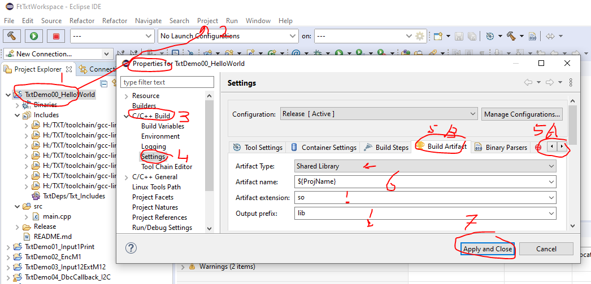
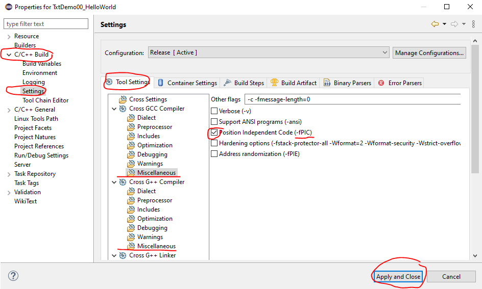
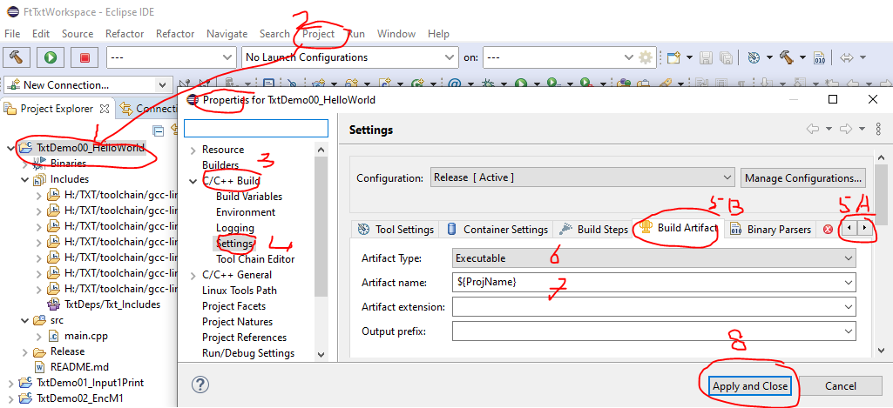

# Content

[Back to main content overview](./README.md#overview)

# How to start with my first fischertechnik C/C++ Eclipse project?

We saw in [How to setup my Eclipse workspace](./HowToStartWithFtTxtWorkspace.md)  how we were able to prepare eclipse for the real thing: creating, compiling and testing of programs for the TXT. 
Now we are going to compile and run some example applications or SLI's and then it is time to setup our first new project.
We will also see how to track and analyze the progress of an ongoing RoboPro program using an SLI or an standalone local application with Putty and Notepad ++

In the root of the `FtTxtWorkspace` you will find an overview of the available examples projects. 
[The FtTxtWorkspace README](./FtTxtWorkspace/README.md) 
There is also information about: 

- compiling
- uploading/installing
- using/starting: 
  - a Sli in a RoboPro programming (only for SLI's).
  - an application.
- how to trace with Putty and consultation of the trace log with Notepad++, [See also](.//README.md#howtracelog)
- How to trace with SPDlog (not yet available).

The 'TxtDeps` root contains also a `README.me` about the instruction of how to make use of these libraries and includes these in your projects

## Adding projects to this `FtTxtWorkspace`
Later you can add more new projects or projects from others into this `FtTxtWorkspace`.
It is also possible to have both SLI and executable projects in this `FtTxtWorkspace`. Both are using the same `FtxDeps`project and `LinaroMap` Environment variable. Only the  `Build Artifact` different.

### Steps
- Add an existing Eclipse TXT project to this workspace.
  Copy that relevant project into the `FtTxtWorkspace` and use the Eclipse menu `File|Import` to add this project to the workspace. **Check if the project properties are fine!** 
  
- Create a new project by copying an existing one.
  Select the project, which you prefer to copy, in the`FtTxtWorkspace`. 
  Go with the right mouse button to the properties and select `Copy`. 
  Go with the right mouse button to the properties and select `Past`. 
  You will see a popup-box with the question for a new name. Fill the name for your project in. Press the `Copy` button. 
  Check the project properties of the `C/C++ General`| `Paths and Symbols`  for the includes are fine. Probably you will need to change some paths. 
  Clean the `src` file and start with coding. 
- How the create a new SLI or application project from scratch has been describe in:   [Project setup from scratch](./ProjectSetUp.md) 

###  `Build Artifact`
The  `Build Artifact` can be changed in the `Project Properties | C/C++Build|Settings` and the tab `Build Artifact`
 
####  `Build Artifact` for a SLI
The SLI is in fact a `shared library` and  such a file has the extension `.so`. 
The Output prefix and extension are important. You may fill in another name for the SLI.
A SLI needs also for both  compilers the option -fPIC been set.fPIC

#### `Build Artifact` for an application
An application has under LINUX and the fischertechnik TXT start mechanism no file extension. 
You may fill in another name for the application.

That is all folks, have fun and success with your proper SLI's and/or applications.

# document history 
- 2020-05-24,26,28 CvL 466.1.2 both, new 
- Original from: on-line training SLI-programming 
  © 2020-04 ing. C. van Leeuwen Btw. Enschede Netherlands
