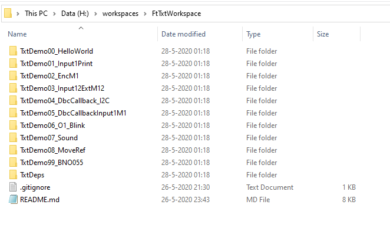
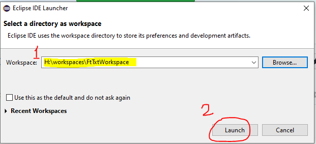
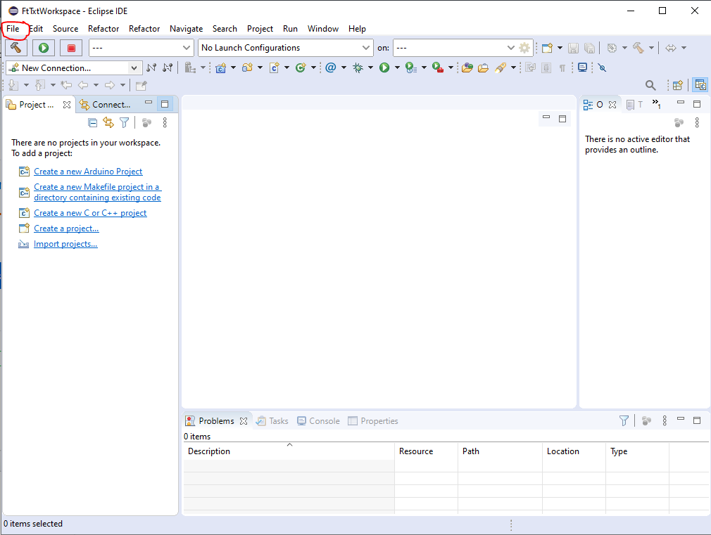
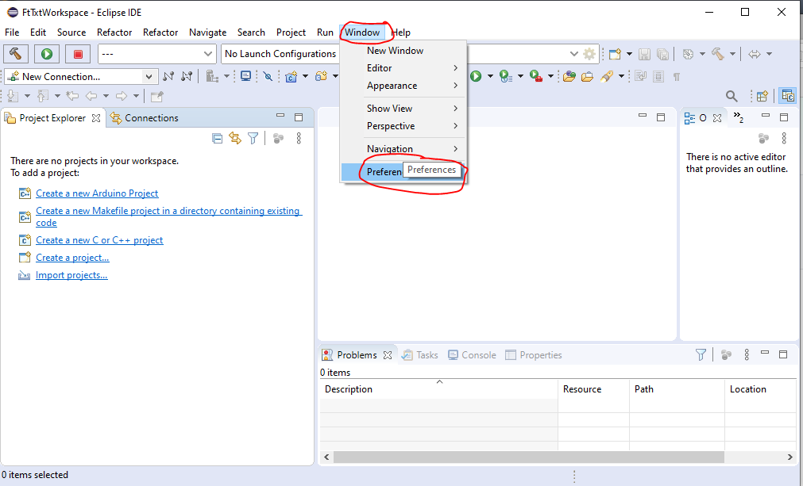
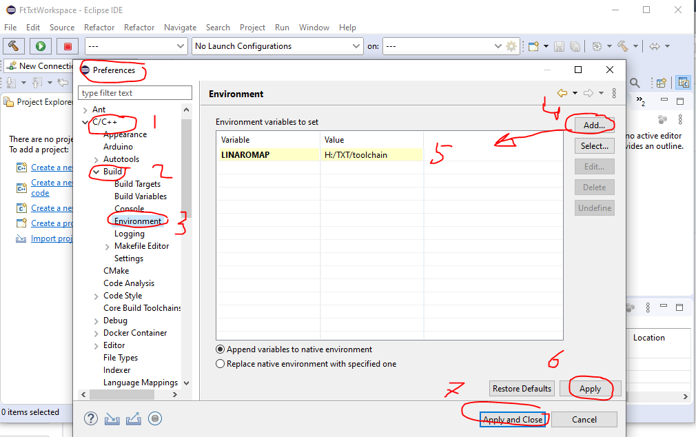
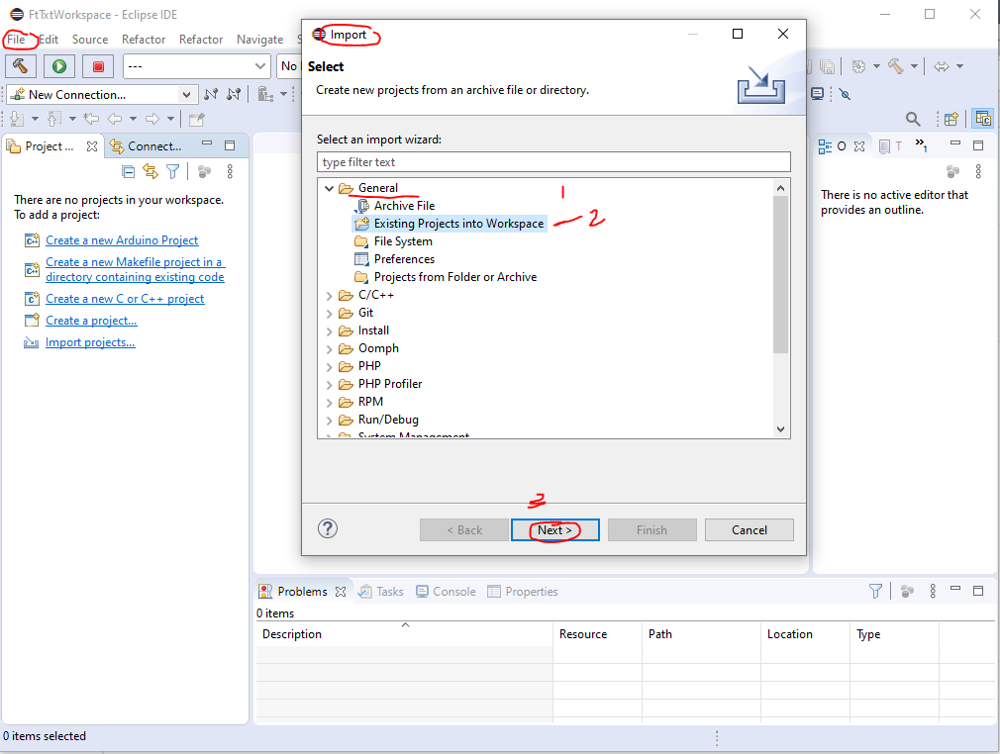
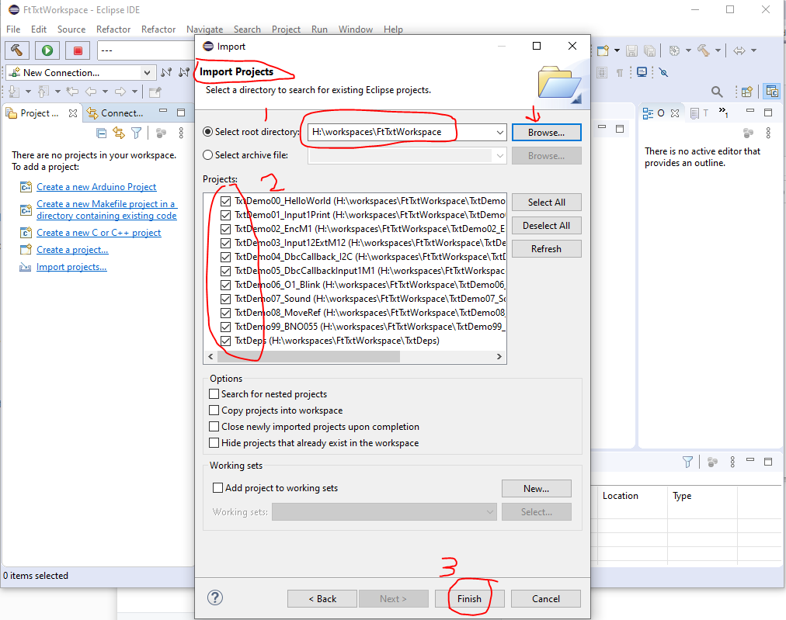
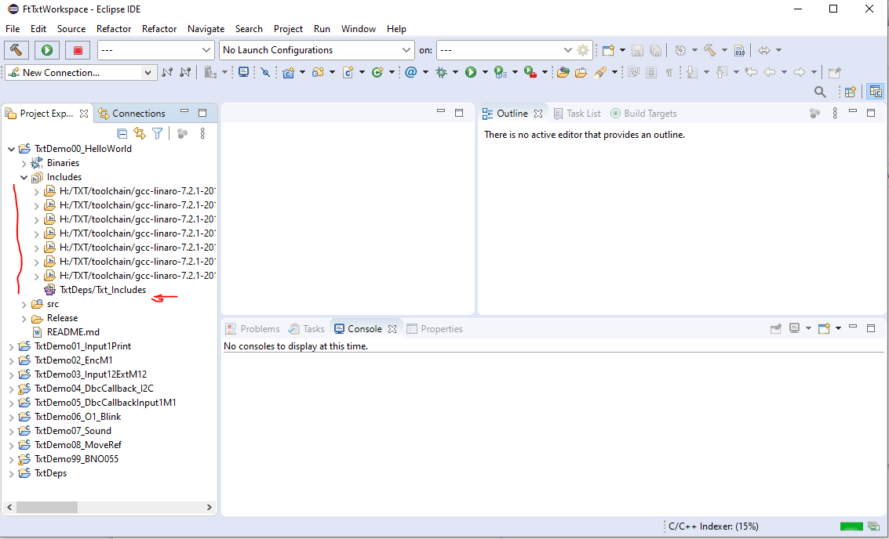

# Content
<!-- TOC depthFrom:1 depthTo:6 withLinks:1 updateOnSave:1 orderedList:0 -->

- [How to setup my fischertechnik workspace in Eclipse?](#how-to-setup-my-fischertechnik-workspace-in-eclipse)
	- [How to set up the FtTxtWorkspace?](#how-to-set-up-the-fttxtworkspace)
- [document history](#document-history)

<!-- /TOC -->
[Back to main content overview](/README.md#overview)

# How to setup my fischertechnik workspace in Eclipse?

Now that [our toolbox](./WhichToolsYouNeed.md) is ready, it is time to learn set up the workspace and how to get started with your own projects via the examples. This is the same for both the SLI as well as the local applications (app's). The TxtDeps (libraries and includes) and the remote toolset are the same. 
The only difference between these two is a small difference in the internal project settings.

> The names of the projects may in reality differ from the images. The structure is similar.

## How to set up the FtTxtWorkspace?
`H:/workspaces` has been used  in this example as path to the `FtTxtWorkspace`. But feel free to use your own path.
- Download the `FtTxtWorkspace.zip` from: 
  - for SLI's: [txt_demo_ROBOPro_SLI/releases](https://github.com/fischertechnik/txt_demo_ROBOPro_SLI/releases)
  - for applications: [txt_demo_c_download/releases](https://github.com/fischertechnik/txt_demo_c_download/releases)
  -
- Unzip this file in the `H:/workspaces`. This will looks like something like:

  
- Start now Eclipse  
  Select the right path to your workspace, here: `H:/workspaces/FtTxtWorkspace`: 
  Press `Launch`.

  

- Close the `Welcome` screen

   

   You will see this screen

  

- Go in the top menu to the item `Windows` en select `Preferences`

  

- Select `C/C++`, `Build` and then `Environment`,  
  add a new Environment variable `LINAROMAP` ([see](./WhichToolsYouNeed.md#linaromap)), 
  and take your path to the Linaro toolchain as value (no / or \ at the end!!), 
  Press `Apply` and `Apply and Close`.

  

  You will see this screen again:

  

-  Go in the top menu to the item `File` en select `Import` 
   Select `General` and `Existing Projects into Workspace` 
   Press `Next`.

  

-  Enter the root directory of the workspace FtTxtWorkSpace, 
   select the appearing 3 projects, 
   press `Finish`.

  

- If everything went well, you will see this. 
   In the Eclipse map Includes (this is not the same as the user map includes) you will see something like this. The ${LINAROMAP} variable has been fill in nicely.

  

   Your workspace is now ready to use, to start programming and testing.
   For example, you can start with compiling the first project.
	
- In the root of the workspace you will find a `README_APP.md` or `READ_SLI.md` were in has been describes the available projects and how to use them.
    - The [xxx document]() will describe how you can get the result to work on the TXT and you will learn about a strategy for troubleshooting and error discovering.
    - The [xxxx document]() will describe how you can create a new project and then start working on your own project.
- With `File | Import` you can also add other existing projects to your workspace. Eclipse is very versatile, see it as a challenge to discover the available possibilities step by step.

# document history 
- 2020-05-18/19/24/26/27 CvL 466.1.1 new
- Original from: on-line training SLI-programming 
  © 2020-04 ing. C. van Leeuwen Btw.  Enschede Netherlands
