# Content
<!-- TOC depthFrom:1 depthTo:6 withLinks:1 updateOnSave:1 orderedList:0 -->

- [Content](#content)
- [How can I setup a new TXT application or SLI project from scratch](#how-can-i-setup-a-new-txt-application-or-sli-project-from-scratch)
	- [Introduction](#introduction)
		- [Step 1 Preparation](#step-1-preparation)
		- [How to add new or import existing projects?](#how-to-add-new-or-import-existing-projects)
	- [How to add a project from scratch?](#how-to-add-a-project-from-scratch)
		- [Step 1](#step-1)
		- [Step 2 Set the type of the project and the name](#step-2-set-the-type-of-the-project-and-the-name)
		- [Step 3 Select Configuration](#step-3-select-configuration)
			- [Step 3A Advanced settings: Set -fPIC flag](#step-3a-advanced-settings-set-fpic-flag)
			- [Step 3B Advanced settings: Set the dialect ISO C11/C++11](#step-3b-advanced-settings-set-the-dialect-iso-c11c11)
			- [Step 3C Advanced settings: Set the reference to the Include in the TxtDeps.](#step-3c-advanced-settings-set-the-reference-to-the-include-in-the-txtdeps)
			- [Step 3D Advanced settings: Set the reference to the Library Paths of the TxtDeps](#step-3d-advanced-settings-set-the-reference-to-the-library-paths-of-the-txtdeps)
			- [Step 3E Advanced settings: Updating the Libraries list](#step-3e-advanced-settings-updating-the-libraries-list)
			- [Step 3E Advanced settings: Preparation](#step-3e-advanced-settings-preparation)
			- [Step 3F To the next step](#step-3f-to-the-next-step)
		- [Step 4 up to 9 reserve](#step-4-up-to-9-reserve)
		- [Step 10 Cross GCC Commands](#step-10-cross-gcc-commands)
		- [Step 11 up to 12 reserve](#step-11-up-to-12-reserve)
		- [Step 13 + 14](#step-13-14)
		- [Step 15 + 16](#step-15-16)
		- [Step 17](#step-17)
		- [Step 18](#step-18)
		- [Step 19 Updating the Library list (continue)](#step-19-updating-the-library-list-continue)
		- [Step 20](#step-20)
- [document history](#document-history)

<!-- /TOC -->
# How can I setup a new TXT application or SLI project from scratch

## Introduction
### Step 1 Preparation 
> If you have already a workspace with the TxtDeps ready then you can  [skip this step](#skip1).

- To start with a new application project, you need to have a workspace, for example `H:\workspace\FtTxtWorkspace` .  
`FtTxtWorkspace` is here your Eclipse workspace name.
- In this workspace you place the `TxtDeps-project` (if it is not their already). This `TxtDeps`-project contains all the information about the includes and libraries which are available on the TXT.
- Now you can start Eclipse. Eclipse will ask for the workspace directory.  

- There is one important preference setting for the workspace to realize. The directory to your Linaro toolchain.  
In this example the toolchain `gcc-linaro-7.2.1-2017.11-i686-mingw32_arm-linux-gnueabihf` has been installed in `H:\TXT\toolchain\`
  - Go in the Eclipse top menu to the item `Windows` and select the `preferences`.  
.PNG)

  - Select in the preferences the item `Build` and then `Enviroment`.  
.PNG)   
Fill in as <strong>Variable</strong>  `LinaroMap`. (Take care of the capital and small.)    
And press `Apply and Close`
- How to add the library TxtDeps to Eclipse?
  - Go in the Eclipse top menu to the item `Files` and select the `Import`.  
    
  Select `Existing Projects into Workspace` and press `Next`.

  - Select the workspace root `H:\workspace\FtTxtWorkspace` and the project `TxtDeps` appears.  
       
  Select this project and press on `Finish`.
  
Now is your workspace ready to add new or import existing projects to it.

### How to add new or import existing projects?

There are a couple of ways to start a new project within Eclipse:
1. [Create a new project from scratch with the Eclipse File-menu.](#scratch).
1. Add/Import the TxtNewProj to your workspace and rename it.
  You need to check the project settings of the new project.
1. Copy the project in the Eclipse Project Explorer and Paste it there too.
   Eclipse will ask you for a new name for the project.
   You need to check the project settings of the new project.
   Remove what your not need.

## How to add a project from scratch?
### Step 1
Go the the top menu `File` and select `New C/C++ Project`.

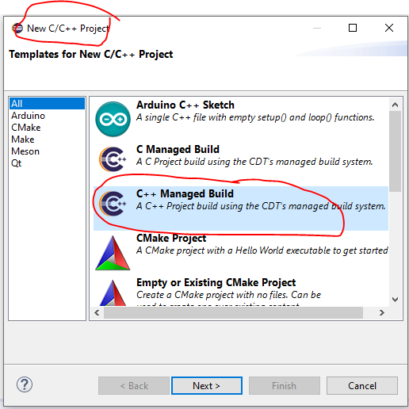

Select `C++ Managed Build` and press `Next`.

### Step 2 Set the type of the project and the name
Add a name for your project.  

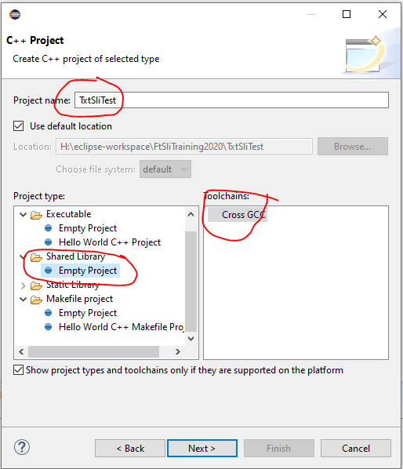  

Choose `Shared Library` for a SLI  or `Executable` for an TXT application.   
And select the `Cross GCC` option and press `Next`.

### Step 3 Select Configuration

For the moment we don't use the Debug configuration so only the release

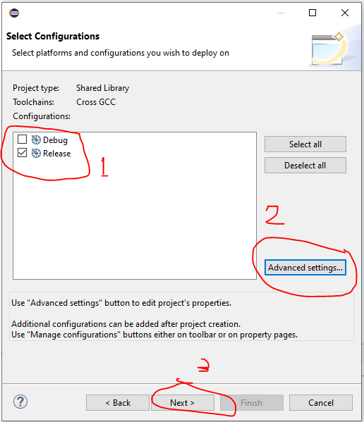

press `Advanced settings...`.

#### Step 3A Advanced settings: Set -fPIC flag
(Only needed for SLI's) 
Set the `-fPIC` position independent code generation 
  
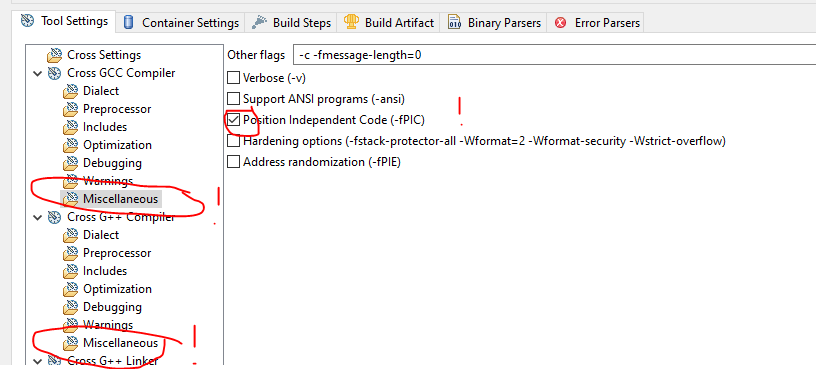  

Set the compiler option. This is important for dynamic linking. 
If forgotten the compiler will generate an error. 
Press `Apply`

#### Step 3B Advanced settings: Set the dialect ISO C11/C++11
C/C++ knows a lot of dialects.

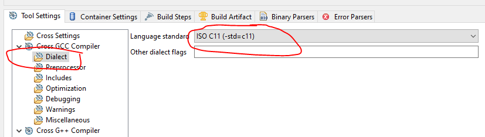

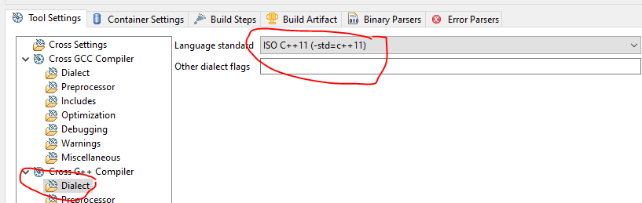 
 
Press `Apply`

#### Step 3C Advanced settings: Set the reference to the Include in the TxtDeps.

Press `Apply`

#### Step 3D Advanced settings: Set the reference to the Library Paths of the TxtDeps
Add both the Txt_libs`` and `Txt_Libs_deps` to `Library`.

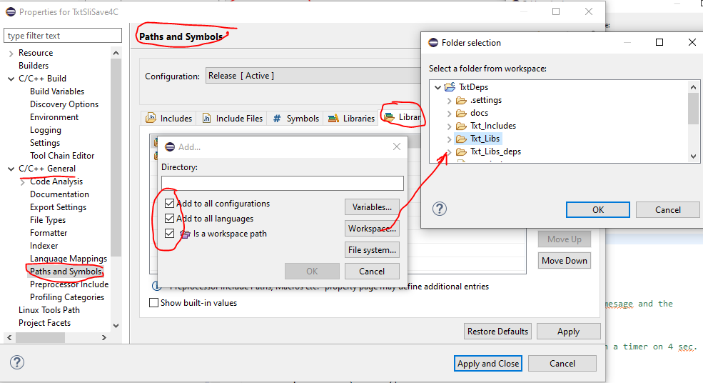

Press `Apply`

#### Step 3E Advanced settings: Updating the Libraries list
For Updating the long dynamic library link list we are going to use a little tric. 
The .cproject file will edit directly.

#### Step 3E Advanced settings: Preparation
A small preparation:    
Add a dummy so you can find back the library section in the .cproject later.

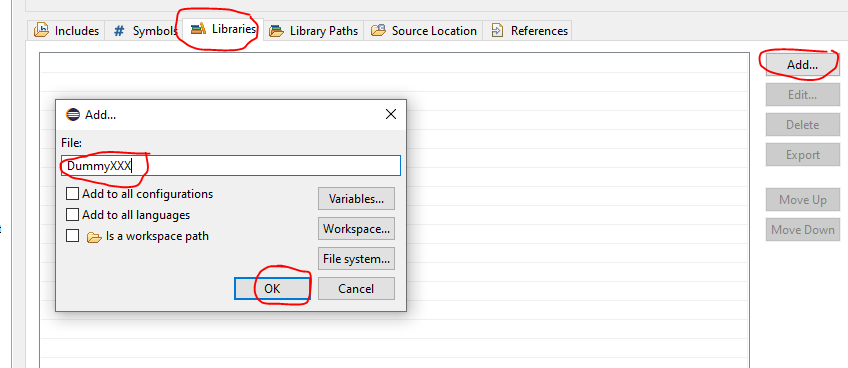

Press `Apply and Close`.

#### Step 3F To the next step
You are ready with step 3 so press (3) `Next` for the next step. 
 

### Step 4 up to 9 reserve

### Step 10 Cross GCC Commands
Now the reference to the tool chain needs to be fill in and we are going to use our workspace environment variable `LinaroMap` in the form `${LinaroMap}`   
The cross compiler prefix = **arm-linux-gnueabihf-**   
The cross compiler path =**${LinaroMap}\gcc-linaro-7.2.1-2017.11-i686-mingw32_arm-linux-gnueabihf\bin**   
So after browsing you will need to replace the directory part with `${LinaroMap}`.

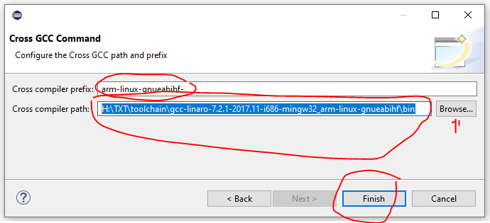

And press `Finish` and the base for your project is ready.

### Step 11 up to 12 reserve

### Step 13 + 14
Add two maps to the project:
1. src: for the source files
2. inlcudes: for the header files
3. you can add more if you need for the organization of your project.

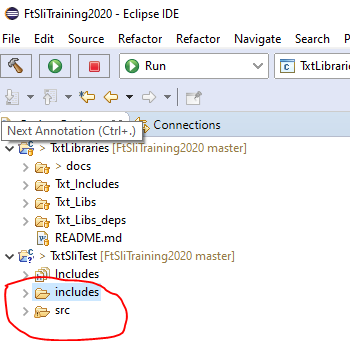

### Step 15 + 16
Add the include and src to the project properties.

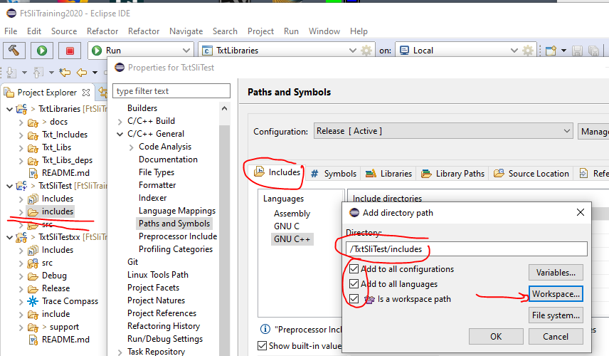

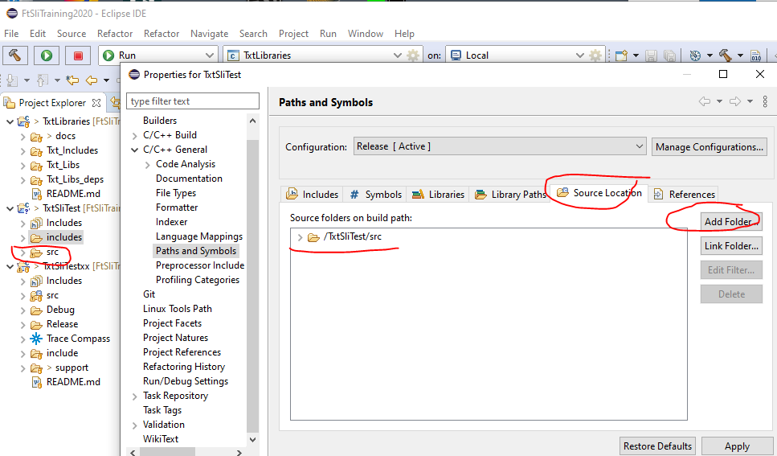

### Step 17
Check The Environments settings.
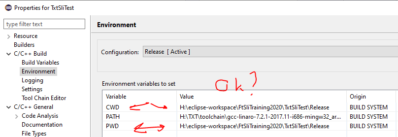

### Step 18
Set the build engine to the internal one. Otherwise the compiler will generate an error at the beginning of a build of your project.

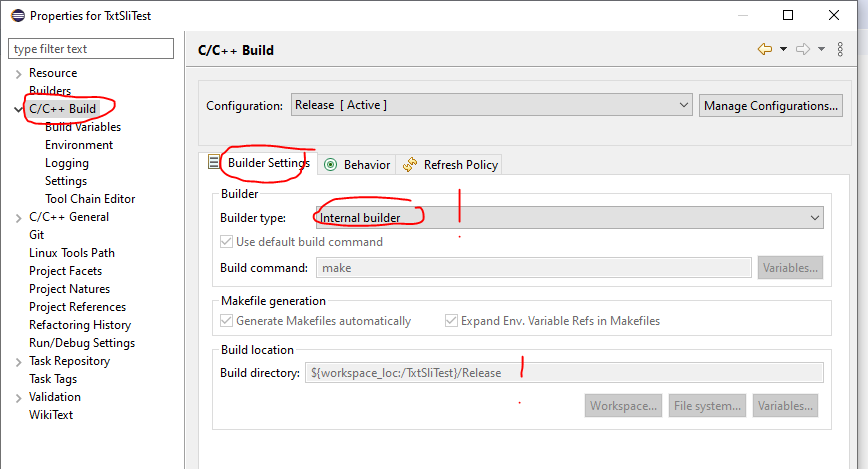

### Step 19 Updating the Library list (continue)
Close your new project.

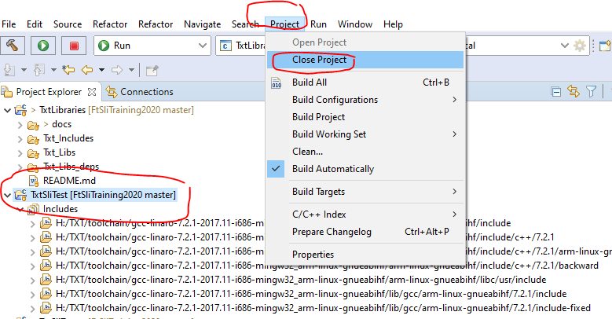

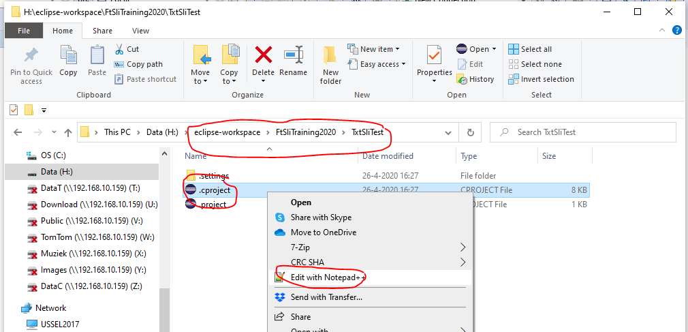

### Step 20
1. Close the project.
2. Open the .cproject in Notepad++
3. Search for the DummyXXX project
4. Copy the XML list with library names from the [README](./FtTxtWorkspace/TxtDeps/README.md) in the `TxtDeps` project
5. Drop this list here.
6. Don't forget to remove the XML entry with the dummy.
7. Open the project again in Eclipse and inspect the library list in the project properties.

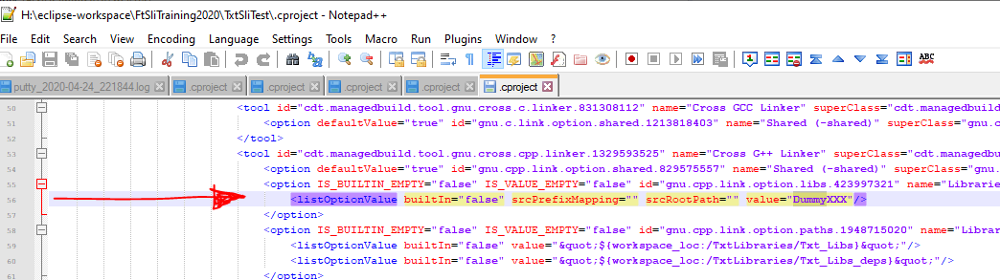

# document history 
- 2020-05-16,28 CvL 466.1.1 new

