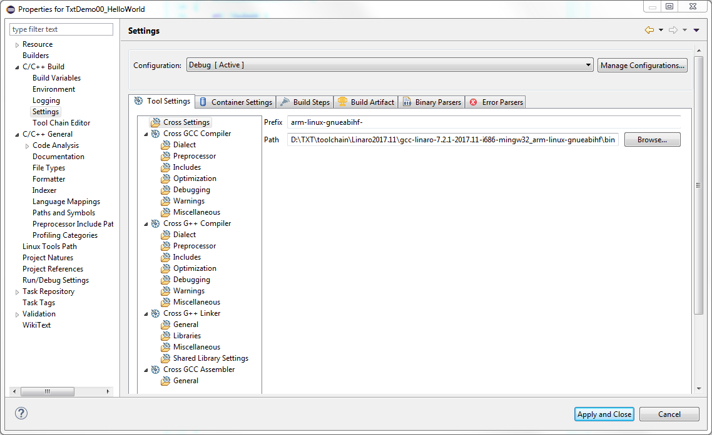
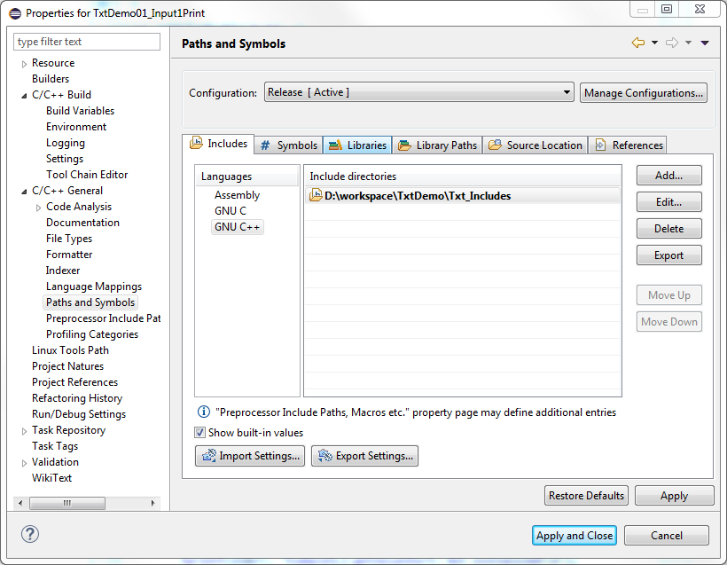
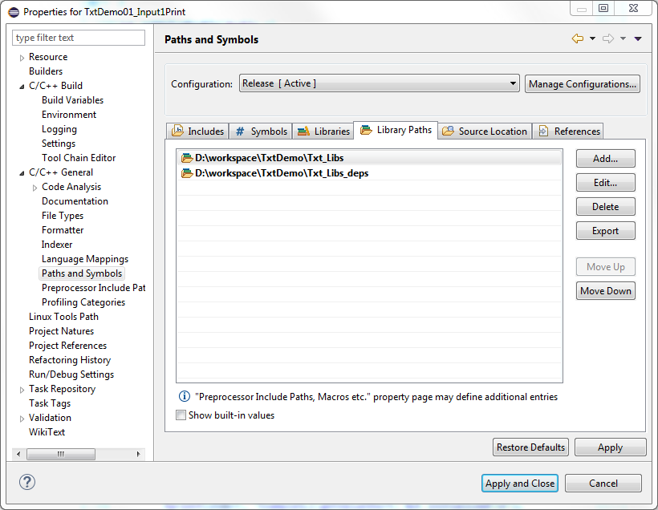
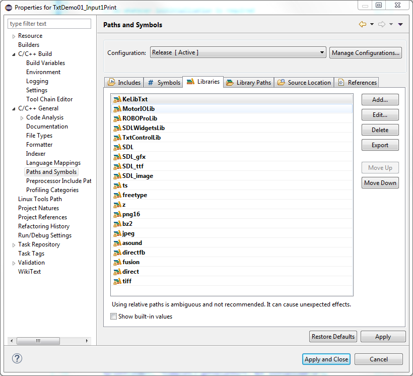

# TXT C Download Examples

## TXT Programming

The fischertechnik TXT controller has an (embedded) Linux system that allows communication via WLAN, Bluetooth or USB interface. 
The network protocol is used for control by means of interfaces and the TXT can thus be directly activated via IP addresses. 

In the previous Robo interface, it was important to know whether the interface was connected to the computer via the serial interface or the USB interface and the programming varied accordingly.
In TXT, this differentiation has been done away with using the network protocol. Every interface of the TXT (USB, BT, WLAN) has a separate IP address. This makes the different programs more convenient and only the desired IP address must be used.

The sensors and actuators of the fischertechnik TXT controller can be controlled in two ways:

- **Online programming**
Here, a computer can control a controller via the USB cable, WLAN or Bluetooth (BT). The documentation can be found in 
[TXT C-Programming Expert Kit](https://www.fischertechnik.de/-/media/fischertechnik/fite/service/downloads/robotics/txt-controller/documents/09-txt-c-programming-expert-kit.ashx) on the fischertechnik website.

- **Download programming**
Here, a program is created with a cross compiler and transferred to the TXT, and it can be started there via the menu system. This documentation shows how an eclipse development environment can be used to create C download programs for the TXT. You can also use other IDE, e. g. Visual Studio or CodeLite.

## Installation

### Eclipse IDE
Download and install:
- [Java JRE](http://www.oracle.com/technetwork/java/javase/downloads/jre8-downloads-2133155.html)
- [Eclipse CDT](http://www.eclipse.org/downloads/packages/release/photon/r/eclipse-ide-cc-developers)

### TXT Tool Chain (TXT firmware >= 4.4.3)
Download:
- [Linaro 2017.11](https://releases.linaro.org/components/toolchain/binaries/7.2-2017.11/arm-linux-gnueabihf/gcc-linaro-7.2.1-2017.11-i686-mingw32_arm-linux-gnueabihf.tar.xz)

## Setting up Eclipse IDE
1. Clone demo examples from GIT repository to a workspace folder.
2. Start Eclipse CDT and import the examples from workspace
3. Change 'Prefix' and 'Path' to the tool chain location

4. Change project properties in 'Paths and Symbols'

   
## Overview of the Demo Programs
There are several sample programs that explain the control of the TXT.

### TxtDemo00_HelloWorld
The demo program prints "TXT: Hello World!" to cout.

### TxtDemo01_Input1Print
The demo program prints analog value to cout.
> Master TXT:
> - Input I1: Voltage

### TxtDemo02_EncM1
The demo program shows the distance operation of the encoder motor. We thus recom-mend that you plug a rest gear wheel 137677 to the axle and highlight a wheel. The program switches the motor for 2 rotations, then waits for a second and carries out the same number of rotations in the opposite direction. Then the program ends.
> Master TXT:
> - Output M1	Encoder motor
> - Input C1	Counter signal of the encoder motor

### TxtDemo03_Input12ExtM12
The demo program shows the initialisation of the universal inputs and then requests them for 10 seconds. If the key is pressed, the M1 motor is switched on. The measured distance value of the ultrasonic sensor controls the M2 motor in the 0..100 cm area with a proportional speed. The program automatically ends after 10 seconds.

> Master TXT:
> - Input I1	key
> - Input I2	Ultrasonic sensor (if present)
> - Output M1	Light or motor
> - Output M2	Light or motor

> Extension TXT (Connect Extension only if a second TXT is present.):
> - Input I1	key
> - Input I2	Ultrasonic sensor (if present)
> - Output M1	Light or motor
> - Output M2	Light or motor

### TxtDemo04_DbcCallback_I2C
This example shows the data output at the I2C bus.
The I2C unit must first be initialised, and the I2C function can then be used to write the desired number of bytes and then read in the response.

> Master TXT:
> - I1: Switch
> - I2C: PCF8574 with LED's on the Outputs

### TxtDemo05_DbcCallbackInput1M1
The demo program shows the use of CallBack routine. As long as this function is set up, it is called up during the data exchange with the hardware after the inputs are read in and the output information is output. 

The CallBack routine should not need a lot of time so that the timing is not affected. During the routine, the key - in order to show it as an example - is debounced and the motor is then switched depending on the input.

The program ends after the key is pressed 10 times at the I1 input.

> Master TXT:
> - Input I1	key
> - Output M1	Light or motor
