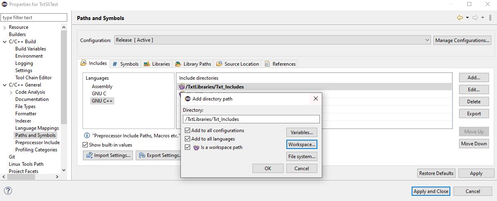
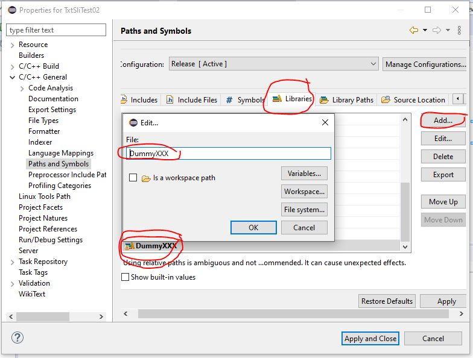

# TXT Shared Library Interface (SLI) Supporting libraries
version: 2020-04-26

TXT firmware 4.6.6 , 4.7.0

Based on the deps map in [txt_training_factory](https://github.com/fischertechnik/txt_training_factory).

The libraries and includes are put in a different Eclipse project.
This makes relative path possible

Can also be used in TXT C/C++ download project in stead of the deps, see also [TXT C/C++ download](https://github.com/fischertechnik/txt_demo_c_download) 

## How to add to your SLI .so dynamic library project

### include path
Add to the include path


### library path
Add both maps to the library path


### library list
Add the names of the dynamic libraries to the library list, manually one by one.

You can remove libs you don't need in your project or add a name.
Sometimes it could be necessary to change to order, select a lib name and move it up/down.

#### Alternative to update the library list
You can also copy this list into the .cproject file (XML-file)
1. How to find were to insert this code?
1. Make a dummy name in the project file, for example DummyXXX. 
1. Close the project. 
1. Open the .cproject in Notepad++.
1. Search the DummyXXX and add the code lines.
1. DOn't forget to temove the dummy.



##### The code to add
```
									<listOptionValue builtIn="false" srcPrefixMapping="" srcRootPath="" value="ROBOProLib"/>
									<listOptionValue builtIn="false" srcPrefixMapping="" srcRootPath="" value="KeLibTxt"/>
									<listOptionValue builtIn="false" srcPrefixMapping="" srcRootPath="" value="MotorIOLib"/>
									<listOptionValue builtIn="false" srcPrefixMapping="" srcRootPath="" value="TxtControlLib"/>
									<listOptionValue builtIn="false" value="dl"/>
									<listOptionValue builtIn="false" value="pthread"/>
									<listOptionValue builtIn="false" value="SDLWidgetsLib"/>
									<listOptionValue builtIn="false" value="SDL"/>
									<listOptionValue builtIn="false" value="SDL_gfx"/>
									<listOptionValue builtIn="false" value="SDL_ttf"/>
									<listOptionValue builtIn="false" value="SDL_image"/>
									<listOptionValue builtIn="false" value="paho-mqttpp3"/>
									<listOptionValue builtIn="false" value="paho-mqtt3c"/>
									<listOptionValue builtIn="false" value="paho-mqtt3a"/>
									<listOptionValue builtIn="false" value="opencv_core"/>
									<listOptionValue builtIn="false" value="opencv_videoio"/>
									<listOptionValue builtIn="false" value="opencv_imgcodecs"/>
									<listOptionValue builtIn="false" value="opencv_imgproc"/>
									<listOptionValue builtIn="false" value="ts"/>
									<listOptionValue builtIn="false" value="freetype"/>
									<listOptionValue builtIn="false" value="z"/>
									<listOptionValue builtIn="false" value="png16"/>
									<listOptionValue builtIn="false" value="bz2"/>
									<listOptionValue builtIn="false" value="jpeg"/>
									<listOptionValue builtIn="false" value="asound"/>
									<listOptionValue builtIn="false" value="directfb"/>
									<listOptionValue builtIn="false" value="fusion"/>
									<listOptionValue builtIn="false" value="direct"/>
									<listOptionValue builtIn="false" value="tiff"/>
									<listOptionValue builtIn="false" value="jsoncpp"/>
```

(c) 2020 C. van Leeuwen Enschede Netherlands


