<!-- TOC depthFrom:1 depthTo:6 withLinks:1 updateOnSave:1 orderedList:0 -->

- [What is in my toolbox?](#what-is-in-my-toolbox)
	- [Toolbox for the starter](#toolbox-for-the-starter)
		- [Step 1 What to download?](#step-1-what-to-download)
		- [Step 2 How to install?](#step-2-how-to-install)
			- [Maps](#maps)
			- [Software](#software)
		- [Step 3 How to setup the software?](#step-3-how-to-setup-the-software)
			- [How to prepare the TXT controller?](#how-to-prepare-the-txt-controller)
			- [How to set up Putty for a SSH connection with the TXT? ](#how-to-set-up-putty-for-a-ssh-connection-with-the-txt-a-idputtysetupa)
			- [How to set up FileZilla? ](#how-to-set-up-filezilla-a-idfilezillasetupa)
			- [How to set up Eclipse?](#how-to-set-up-eclipse)
			- [Install Graphviz](#install-graphviz)
- [document history ](#document-history-a-idhistorya)

<!-- /TOC -->
[Back to main content overview](./README.md#overview)

# What is in my toolbox?

As software developer you need a tool box, your software development environment. For the more experience software engineers this is a personal set of tools. But were to start as beginner?  Creative programming and problem solving is more then only entering program code and compiling. It has also something to do with:
- understand and describe the problem
- create and describe a solution
- implement this solution including documentation
- testing an error searching.

For this there is  needed a set of tools. Hereby an overview:

- a program development environment with some plug in tools, like
- a remote SSH terminal
- a SFTP file transfer tools
- RoboPro 4.6.6
- TXT with firmware 4.6.6 or 4.7.0
- a  documentation generator
- a basic text editor for text (and later markdown, XML/JSON/HTML, etc.)

## Toolbox for the starter

This is a piece of advice only. However, these tools can be used in this introduction.

### Step 1 What to download?

1. Eclipse 
Versie: Eclipse 2020-03 or higher (only 64 bits) 

   [Download]( https://www.eclipse.org/downloads/packages/release/2020-03/r/eclipse-ide-cc-developers-includes-incubating-components)  Remark: This is only the installer.

   Here you can find [additional help]( https://help.eclipse.org/2020-03/index.jsp)  
   Eclipse has two different possibilities to install additional functionality.

1. Linaro 
The TXT firmware is using gcc-linaro-7.2.1-2017.11-i686-mingw32_arm-linux-gnueabihf.

   [Download]( https://releases.linaro.org/components/toolchain/binaries/7.2-2017.11/arm-linux-gnueabihf/gcc-linaro-7.2.1-2017.11-i686-mingw32_arm-linux-gnueabihf.tar.xz)

1. FileZilla 

   [Download]( https://filezilla-project.org/download.php)

1. Putty 

    [Download](https://putty.org/)

1. Notepad ++ 

    [Download]( https://notepad-plus-plus.org/downloads/)
    This software can be use to inspect log files and edit text files. 
 [Plugins overview]( https://npp-user-manual.org/docs/plugins/) 
 [Plugins List](https://github.com/notepad-plus-plus/nppPluginList/), suggestions for Plugins: 
    - MarkdownViewerPlusPlus

1. ATOM editor 

   [Download](https://atom.io/ Atom 1.46.0 ot higher)  
   Packages: [the functionality of Atom can be extended with the so called packages.](https://atom.io/packages) 
Suggestions for packages:
    - language-markdown
    - markdown-preview-plus
    - markdown-image-paste

1. VNC-client 
   The TXT has an VNC-server. This makes it possible that the screen of the TXT can be control remotely. A nice possibility when you RoboPro program runs locally. 
   To make use of the TXT VNC-server you will need a VNC-viewer (client):
   [Download RealVNC viewer](https://www.realvnc.com/en/connect/download/viewer/)

1. Graphviz 
For the graphical part of the DOxyGen documentation tool you will need to install graphviz.
[Download](https://graphviz.gitlab.io/_pages/Download/Download_windows.html)

1.	RoboPro 
    [See here for RoboPro 4.6.6 and the firmware 4.6.6 and 4.7.0](
https://github.com/fischertechnik/FT-TXT/releases) 
Firmware 4.7.0 can be boot from SD-card and used in corporation with RoboPro 4.6.6.

### Step 2 How to install?
Note: Graphviz needs to be install after the installing  Eclox from the Eclipse Marktplace.

#### Maps
First of all, create on the same drive, the following maps:
-	\eclipse\\ 
  Installation map for Eclipse
-	\workspaces\\ 
  Map were you can put the root maps for the Eclipse workspaces.
-	\TXT\ 
-	\TXT\toolchain\ 
  Installation map for the Linaro toolchain
-	\Log\ 
- \Log\Putty\ 
   Map for the Putty Log-files

#### Software
After this, start with the installation of the downloaded software
-	Install Notepad ++, Atom ,FileZilla, Putty and RealVNC viewer 
 like you are used to doing with Windows programs. 
 Their installation programs will guide you through the process.

- Eclipse  
Run the installer. 
Install “Eclipse IDE for C/C++ developers” in the map: `H:\eclipse\cpp-2020-03`. 
The installer will also install or ask for “Java 1.8+ VM”. 
Eclipse is a JAVA application and needs Java. 
See also the following 3 screen dumps:

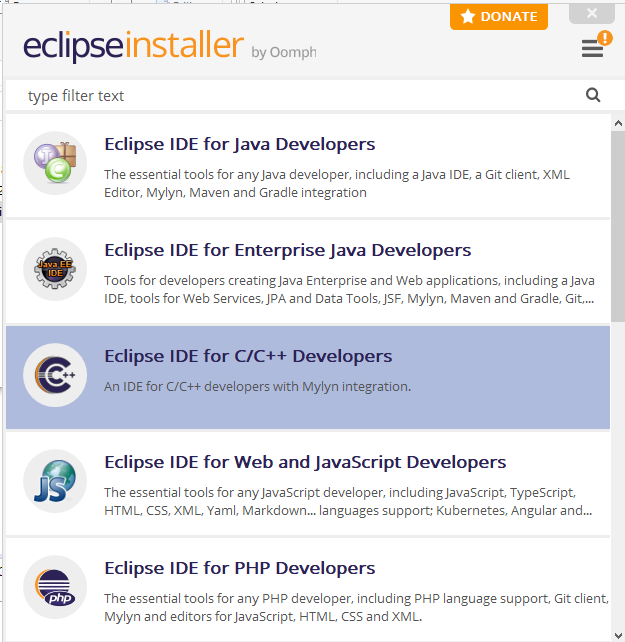
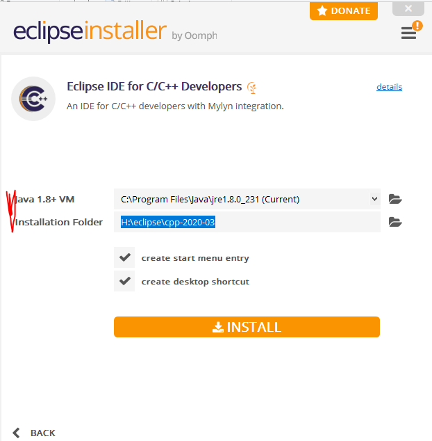
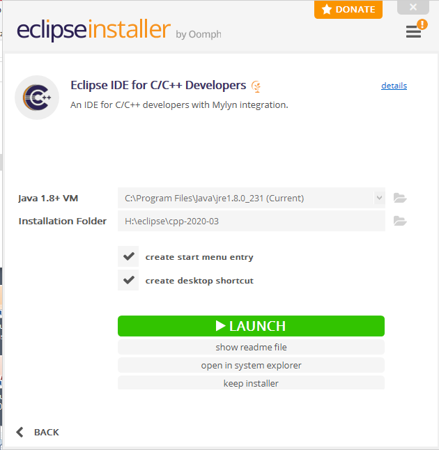

- Linaro 

    Last but not least is making the Linaro toolchain available. 
Unzip the Linaro toolchain into the map `<drive>\TXT\toolchain\`. 
You will get something like this. 
 `H:\TXT\toolchain\gcc-linaro-7.2.1-2017.11-i686-mingw32_arm-linux-gnueabihf` 
In this case the drive is `H:` but it could be a different drive. This path `<drive>\TXT` you will need later as [workspace Environment variable](./HowToStartWithFtTxtWorkspace.md#wsenvvar) to configurate the tool chain in your C/C++ project in Eclipse. 
An image of how this looks like in the Windows explorer:

  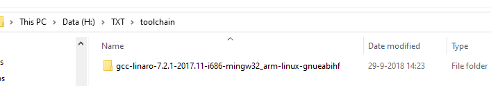

### Step 3 How to setup the software?
Prepare the TXT, the SSH remote console) and SFTP (remote file system)
Setting up FileZilla and Putty. Install DoxyGen with Eclipse Marktplace.

#### How to prepare the TXT controller?

  It is time to create the connections with your TXT.

  - Start your TXT and test the connection with RoboPro.
  - Write down the IP-address of this connection. It does not matter if you are using Bluetooth, USB, Wifi or Wifi-access point.
  - Don’t forget to activate on the your the SSH Daemon, VNC server and WEB server (fw 4.6.6 and fw 4.7.0) and SD boot (4.6.6) (The screen shot are from fw 4.7.0)

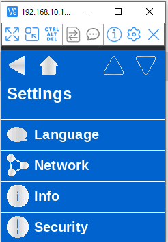
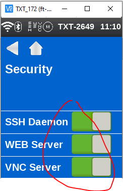

#### How to set up Putty for a SSH connection with the TXT? 
Putty is a remote console; it can be used to work with LINUX command.
We are using Putty as console.

Start Putty and create a new SSH-session with the general user ROBOPro.
The user name: `ROBOPro`, the password: `ROBOPro`
- Fill in the IP-address from your TXT01
- Choose SSH
- Fill in the map for the logfiles: `H:/Log/Putty/putty_&Y-&M-&D_&T.log` .
-	As remote command: [screen -r](https://www.geeksforgeeks.org/screen-command-in-linux-with-examples/)
   You can find what this means in the Linux command help on the internet. 
   When you leave this line blanc, you will get the LINUX command prompt.
	 - Save these settings and start the connection.
	 - Run with RoboPro a small RoboPro program and observe what the console shows you.
	 - Go with the Windows file manager to the \Log\Putty\ map and open the log file with Notepad++.
	 Now you can also inspect the results. When the log file changes, Notepad++ will reload the file.
	 - Warning: Use only the TXT root account for exceptional activities.

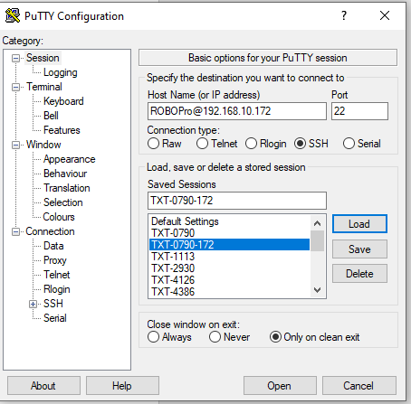

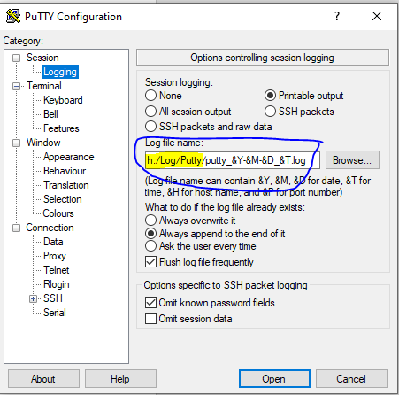

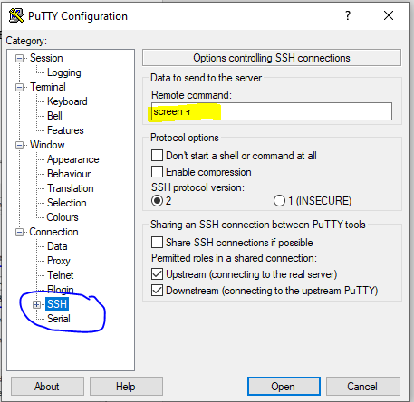

#### How to set up FileZilla? 
FileZilla is a file transfer program.
- Start FileZilla, go to the “file” menu and start the “site manager”.
- Create a “new site” for a SFTP- (Secure File Transfer Protocol)
for the IP-address of the TXT controller.
The user name: `ROBOPro`,
 the password: `ROBOPro`.
  - Warning: Use only the root account for very special activities

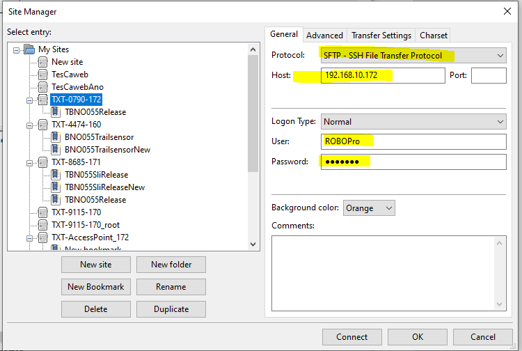

Start FileZilla and observe what you are seeing. 
Remark: The public maps can also be inspected and maintained via the TXT web interface. 
See for an introduction the first part on [this link:]( https://github.com/fischertechnik/txt_training_factory/blob/master/doc/WEBServer_de.md)

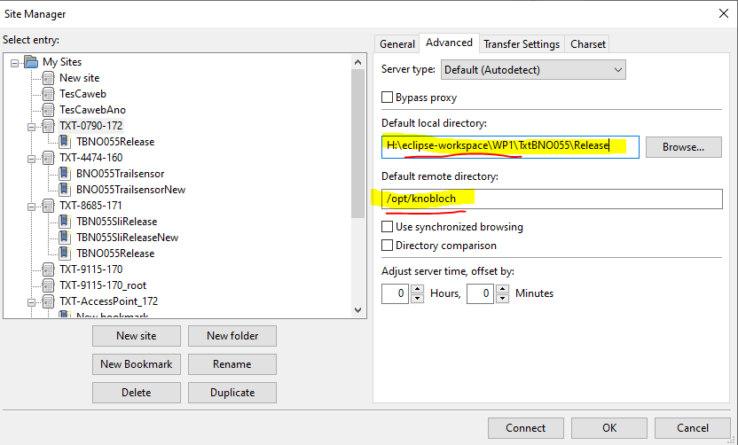

-  The “default local directory” is for later.
-  The “default remote library” is normally `/opt/Knobloch/`.
    Here you will find the maps for the `Data`, `libs`, `C-program`, etc.

#### How to set up Eclipse?
How to work with the SLI workspace and set up a new project will discuss later. But we still have to install the DoxyGen tool as code documentation plugin for Eclipse.

   installation: [Eclox via Eclipse Markplace](https://anb0s.github.io/eclox/),  [See also](http://www.doxygen.nl/download.html)
   - Start Eclipse
   - Go to top menu `Help`
   - Select `Eclipse Markplace..`
   - Search for `Eclox`
   - Install eclox
   - `Install Now` and `Finish`
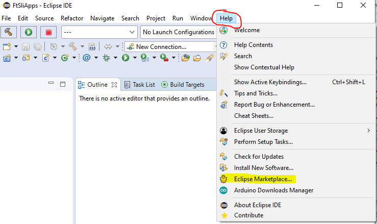

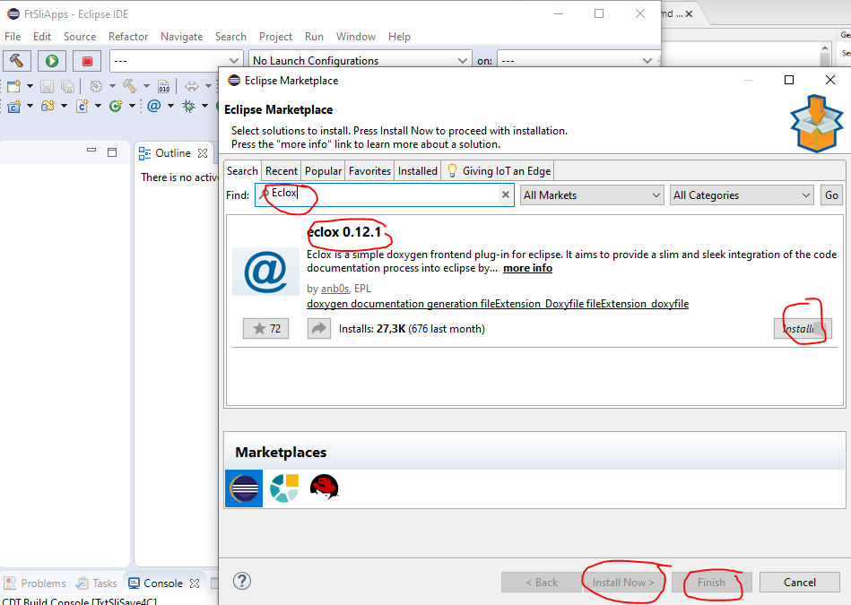

#### Install Graphviz
Install the Windows application `Graphviz`.  **Check after the installation** if the path to the bin has been added to the System Environment variable `Path`!

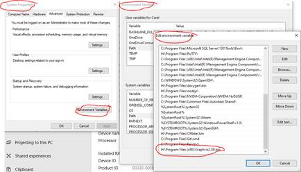 

Now we are ready to start with the [How to setup my fischertechnik SLI workspace in Eclipse?](./HowToStartWithFtTxtWorkspace.md)

# document history 
- 2020-05-16/17/18/19/24 CvL 466.1.1 new 
- Original from: on-line training SLI-programming 
  © 2020-04 ing. C.van Leeuwen Btw. Enschede Netherlands
